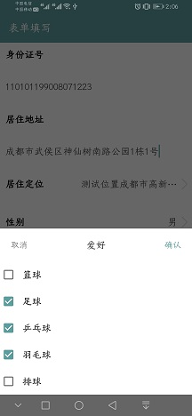
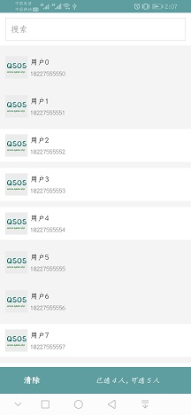

# 概要

版本core_vision: [](https://www.jitpack.io/#hslooooooool/abcl-c)

ABCL-C层提供一些独立功能供使用，各功能相互独立，采用kotlin协程进行线程处理；
- 网络请求提供kotlin协程和RxJava两种方式；
- 表单组件采用了Room数据库进行操作；
- 异常日志提供日志拦截与保存，便于上传日志到服务器进行记录分析，采用Timber日志框架进行操作，拦截了Warm级别以上的日志，但需要开启Timber日志；
- 文件选择采用RxJava的方式调用回传，参考[RxPermissions](https://github.com/tbruyelle/RxPermissions)/[RxImagePicker](https://github.com/MLSDev/RxImagePicker)；
- 媒体预览采用原生的方式提供支持，包括音频播放、视频/文档本地APP打开等；

使用
```
// 动态表单
implementation 'com.github.hslooooooool.abcl-c:core-form:core_vision'
// 文件选择
implementation 'com.github.hslooooooool.abcl-c:core-file:core_vision'
// 网络服务
implementation 'com.github.hslooooooool.abcl-c:core-netservice:core_vision'
// 异常捕获
implementation 'com.github.hslooooooool.abcl-c:core-exception:core_vision'
// 媒体预览
implementation 'com.github.hslooooooool.abcl-c:core-player:core_vision'
```

## 功能模块
独立功能模块涵盖所有可单独实现的功能，涵盖以下功能：
### 网络请求
```
dependencies {
    implementation 'com.github.hslooooooool.abcl-c:core-netservice:core_vision'
}
```

你的AppApplication如下配置
```
open class AppApplication : BaseApplication(){

    override fun onCreate() {
        super.onCreate()

        /**BASE_URL配置*/
        BaseConfig.BASE_URL = "http://192.168.1.11:8084"
    }

}
```

### 异常捕获
```
dependencies {
    implementation 'com.github.hslooooooool.abcl-c:core-exception:core_vision'
}
```

你的AppApplication如下配置
```
open class AppApplication : BaseApplication(){

    override fun onCreate() {
        super.onCreate()

        /**Timber日志*/
        Timber.plant(GlobalExceptionHelper.CrashReportingTree())
        /**全局异常捕获处理*/
        Thread.setDefaultUncaughtExceptionHandler(GlobalExceptionHelper)
        RxBus.toFlow(GlobalExceptionHelper.ExceptionEvent::class.java)
                .subscribe {
                    dealGlobalException(it.exception)
                }
    }

    /**统一处理异常，如重新登录、强制下线、异常反馈、网络检查*/
    private fun dealGlobalException(ex: GlobalException) {

    }
}
```

### 文件上传与下载(网络请求模块包含实现案例)
```
dependencies {
    implementation 'com.github.hslooooooool.abcl-c:core-netservice:core_vision'
}
```

### 文件选择（拍照、录像、录音、文件选择）
```
dependencies {
    implementation 'com.github.hslooooooool.abcl-c:core-file:core_vision'
}
```

使用案例见表单文教操作配置，如下：
```
class FormConfig : IFormConfig {

    override fun takeCamera(context: Context, formItemId: Long, onSuccess: (FormValueOfFile) -> Any) {
        Timber.tag("表单文件代理").i("拍照")
        RxImagePicker.with((context as FragmentActivity).supportFragmentManager).takeImage(Sources.DEVICE)
                .flatMap {
                    RxImageConverters.uriToFileObservable(context, it, FileUtils.createImageFile())
                }
                .subscribe {
                    val file = FormValueOfFile(fileId = "0001", fileName = it.name, filePath = it.absolutePath, fileType = it.extension, fileUrl = it.absolutePath, fileCover = it.absolutePath)
                    onSuccess.invoke(file)
                }.takeUnless {
                    context.isFinishing
                }
    }

    override fun takeGallery(context: Context, formItemId: Long, canTakeSize: Int, onSuccess: (List<FormValueOfFile>) -> Any) {
        Timber.tag("表单文件代理").i("图库")
        when (canTakeSize) {
            1 -> {
                RxImagePicker.with((context as FragmentActivity).supportFragmentManager).takeImage(Sources.ONE)
                        .flatMap {
                            RxImageConverters.uriToFileObservable(context, it, FileUtils.createImageFile())
                        }
                        .subscribe {
                            val file = FormValueOfFile(fileId = it.absolutePath, fileName = it.name, filePath = it.absolutePath, fileType = it.extension, fileUrl = it.absolutePath, fileCover = it.absolutePath)
                            onSuccess.invoke(arrayListOf(file))
                        }.takeUnless {
                            context.isFinishing
                        }
            }
            in 2..9 -> {
                RxImagePicker.with((context as FragmentActivity).supportFragmentManager).takeFiles(arrayOf("image/*"))
                        .flatMap {
                            val files = arrayListOf<File>()
                            it.forEachIndexed { index, uri ->
                                if (index < canTakeSize) {
                                    RxImageConverters.uriToFile(context, uri, FileUtils.createImageFile())?.let { f ->
                                        files.add(f)
                                    }
                                }
                            }
                            Observable.just(files)
                        }
                        .subscribe {
                            val files = arrayListOf<FormValueOfFile>()
                            it.forEach { f ->
                                files.add(FormValueOfFile(fileId = "takeGallery${f.absolutePath}", fileName = f.name, filePath = f.absolutePath, fileType = f.extension, fileUrl = f.absolutePath, fileCover = f.absolutePath))
                            }
                            onSuccess.invoke(files)
                        }.takeUnless {
                            context.isFinishing
                        }
            }
            else -> onSuccess(arrayListOf())
        }
    }

    override fun takeVideo(context: Context, formItemId: Long, canTakeSize: Int, onSuccess: (List<FormValueOfFile>) -> Any) {
        Timber.tag("表单文件代理").i("视频")
        RxImagePicker.with((context as FragmentActivity).supportFragmentManager).takeVideo()
                .flatMap {
                    RxImageConverters.uriToFileObservable(context, it, FileUtils.createVideoFile())
                }
                .subscribe {
                    val file = FormValueOfFile(fileId = "takeVideo", fileName = it.name, filePath = it.absolutePath, fileType = it.extension, fileUrl = it.absolutePath, fileCover = it.absolutePath)
                    onSuccess.invoke(arrayListOf(file))
                }.takeUnless {
                    context.isFinishing
                }
    }

    override fun takeAudio(context: Context, formItemId: Long, onSuccess: (FormValueOfFile) -> Any) {
        Timber.tag("表单文件代理").i("音频")
        RxImagePicker.with((context as FragmentActivity).supportFragmentManager).takeAudio()
                .flatMap {
                    RxImageConverters.uriToFileObservable(context, it, FileUtils.createAudioFile())
                }
                .subscribe {
                    val file = FormValueOfFile(fileId = "takeAudio", fileName = "音频", filePath = it.absolutePath, fileType = it.extension, fileUrl = it.absolutePath, fileCover = it.absolutePath)
                    onSuccess.invoke(file)
                }.takeUnless {
                    context.isFinishing
                }
    }

    override fun takeFile(context: Context, formItemId: Long, canTakeSize: Int, mimeTypes: List<String>, onSuccess: (List<FormValueOfFile>) -> Any) {
        Timber.tag("表单文件代理").i("文件")
        RxImagePicker.with((context as FragmentActivity).supportFragmentManager).takeFiles(arrayOf("image/*", "video/*", "text/plain"))
                .flatMap {
                    val files = arrayListOf<File>()
                    it.forEachIndexed { index, uri ->
                        if (index < canTakeSize) {
                            RxImageConverters.uriToFile(context, uri, FileUtils.createFileByUri(context, uri))?.let { f ->
                                files.add(f)
                            }
                        }
                    }
                    Observable.just(files)
                }
                .subscribe {
                    val files = arrayListOf<FormValueOfFile>()
                    it.forEach { f ->
                        files.add(FormValueOfFile(fileId = "takeFile", fileName = f.name, filePath = f.absolutePath, fileType = f.extension, fileUrl = f.absolutePath, fileCover = f.absolutePath))
                    }
                    onSuccess.invoke(files)
                }.takeUnless {
                    context.isFinishing
                }
    }

    override fun takeLocation(context: Context, formItemId: Long, location: FormValueOfLocation?, onSuccess: (FormValueOfLocation) -> Any) {
        Timber.tag("表单位置代理").i("位置，已有位置${Gson().toJson(location)}")
        CoroutineScope(Job()).launch(Dispatchers.Main) {
            val takeLocation = async(Dispatchers.IO) {
                FormValueOfLocation(locName = "测试位置成都市高新区孵化园A区B栋", locX = 30.0000, locY = 104.000000)
            }
            val l = takeLocation.await()
            onSuccess.invoke(l)
        }
    }

    override fun takeUser(context: Context, formItemId: Long, canTakeSize: Int, checkedUsers: List<FormValueOfUser>, onSuccess: (List<FormValueOfUser>) -> Any) {
        Timber.tag("表单用户代理").i("用户，已有用户${Gson().toJson(checkedUsers)}")
        RxUserPicker.with((context as FragmentActivity).supportFragmentManager).takeUser(formItemId)
                .observeOn(Schedulers.io())
                .map {
                    FormDatabase.getInstance().formItemValueDao.getByFormItemId(it).filter { v ->
                        !v.limitEdit
                    }.map { v ->
                        v.user!!
                    }
                }.subscribe {
                    onSuccess.invoke(it)
                }.takeUnless {
                    context.isFinishing
                }
    }

    override fun previewFile(context: Context, index: Int, formValueOfFiles: List<FormValueOfFile>) {
        Timber.tag("表单文件预览代理").i("文件$index")
    }

    override fun previewUser(context: Context, index: Int, formValueOfUser: List<FormValueOfUser>) {
        Timber.tag("表单用户预览代理").i("用户$index")
    }
}
```

其中提供了自定义录音操作的demo，调用方式如下，推荐参照实现自己的UI：
```
    override fun takeAudio(context: Context, formItemId: Long, onSuccess: (FormValueOfFile) -> Any) {
        Timber.tag("表单文件代理").i("音频")
        BottomDialogUtils.showCustomerView(context, R.layout.audio_dialog, object : BottomDialog.ViewListener {
            override fun bindView(dialog: AbsBottomDialog) {
                AudioUtils.record(dialog).subscribe({
                    val file = File(it)
                    file.exists().let {
                        val valueOfFile = FormValueOfFile(fileId = "takeAudio", fileName = file.name, filePath = file.absolutePath, fileType = file.extension, fileUrl = file.absolutePath, fileCover = file.absolutePath)
                        onSuccess.invoke(valueOfFile)
                    }
                }, {
                    it.printStackTrace()
                }).takeUnless {
                    (context as AppCompatActivity).isFinishing
                }
            }
        })
    }
```

其中的用户选择，同样采用了RxJava的方式进行了选择回调，详见RxUserPicker:
```
        RxUserPicker.with((context as FragmentActivity).supportFragmentManager).takeUser(formItemId)
                .observeOn(Schedulers.io())
                .map {
                    FormDatabase.getInstance().formItemValueDao.getByFormItemId(it).filter { v ->
                        !v.limitEdit
                    }.map { v ->
                        v.user!!
                    }
                }.subscribe {
                    onSuccess.invoke(it)
                }.takeUnless {
                    context.isFinishing
                }

```


### 动态表单
提供包括文本展示、文本输入、单选/多选、位置设置、日期设置、人员设置、附件（拍照/图库/视频/语音/文件）设置等功能，采用Room数据库进行数据操作
```
dependencies {
    implementation 'com.github.hslooooooool.abcl-c:core-form:core_vision'
}
```

在你的application中初始化表单功能实现
```
open class AppApplication : BaseApplication(){

    override fun onCreate() {
        super.onCreate()

        ...

        /**配置表单文件操作代理实现*/
        FormConfigHelper.init(FormConfig())
    }
}
```

其中FormConfig为IFormConfig接口实现类，表单中文件、位置等操作将调用此接口进行操作并设置数据，你可参考app模块中FormConfig类的处理，
处理方法传递了表单项ID和其他参数，你可以使用表单项ID直接操作数据库或若不想直接操作数据库可使用传递的参数进行操作，实现案例：
```
class FormConfig : IFormConfig {

    override fun takeCamera(formItemId: Long, onSuccess: (FormValueOfFile) -> Any) {
        Timber.tag("表单文件代理").i("拍照")
        CoroutineScope(Job()).launch(Dispatchers.Main) {
            val takeFile = async(Dispatchers.IO) {
                val file = FormValueOfFile(fileId = "0001", fileName = "拍照", filePath = "/0/data/vip.qsos.demo/temp/logo.png", fileType = ".png", fileUrl = "http://www.qsos.vip/resource/logo.png", fileCover = "http://www.qsos.vip/resource/logo.png")
                file
            }
            val file = takeFile.await()
            onSuccess.invoke(file)
        }
    }

    ...
}
``` 
 
;;

;;

### 图片加载-Glide封装

### 媒体文件预览
提供图片轮播、录音播放、文档下载后本地打开支持等功能，视频播放暂不提供
```
dependencies {
    implementation 'com.github.hslooooooool.abcl-c:core-player:core_vision'
}
```
其中PlayerConfig为IPlayerConfig接口实现类，DefPlayerConfig为IPlayerConfig默认实现（提供图片轮播、录音播放等简单功能），
PlayerConfig实现了文档下载后本地打开较高级功能，一般APP可对基础文档提供在线预览，这里不这样作了，仅提供调用本地软件打开，代码如下：
```
    override fun previewDocument(context: Context, data: PreDocumentEntity) {
        // FIXME 测试数据 "http://resource.qsos.vip/test.mp4"
        val mTestUrl = data.path
        when {
            mTestUrl.startsWith("http") || mTestUrl.startsWith("ftp") -> {
                // 网络文件，先下载再调用本地软件打开
                val mFileHelper = FileHelper()
                BottomDialogUtils.showCustomerView(context, R.layout.file_download_dialog,
                        viewListener = object : BottomDialog.ViewListener {
                            override fun bindView(dialog: AbsBottomDialog) {
                                var mFilePath: String? = null
                                val state = dialog.findViewById<TextView>(R.id.file_state)
                                val progress = dialog.findViewById<ProgressBar>(R.id.file_progress)
                                val action = dialog.findViewById<Button>(R.id.file_action)
                                val handler = Handler(Looper.getMainLooper())
                                action.text = "下载"
                                action.setOnClickListener {
                                    when (action.text) {
                                        "下载" -> {
                                            action.text = "取消"
                                            state.text = "开始下载"
                                            progress.progress = 0
                                            mFileHelper.downloadFile(HttpFileEntity(mTestUrl, null, "test.mp4", 0),
                                                    object : OnTListener<HttpFileEntity> {
                                                        override fun back(t: HttpFileEntity) {
                                                            if (t.progress == 100) mFilePath = t.path
                                                            handler.post {
                                                                progress.progress = t.progress
                                                                state.text = t.loadMsg
                                                                if (t.progress == 100) action.text = "打开"
                                                            }
                                                        }
                                                    })
                                        }
                                        "打开" -> {
                                            try {
                                                FileUtils.openFileByPhone(context as Activity, File(mFilePath))
                                            } catch (e: Exception) {
                                                e.printStackTrace()
                                                Timber.tag("文件预览").e(e)
                                            }
                                        }
                                        "取消" -> {
                                            dialog.dismiss()
                                        }
                                    }
                                }
                            }
                        },
                        cancel = true,
                        dismissListener = DialogInterface.OnDismissListener {
                            mFileHelper.clear()
                        })
            }
            else -> {
                // 本地文件，调用本地软件打开
                try {
                    FileUtils.openFileByPhone(context as Activity, File(data.path))
                } catch (e: Exception) {
                    e.printStackTrace()
                    Timber.tag("文件预览").e(e)
                }
            }
        }
    }

```

 

# 项目清单
- [ABCL安卓快速开发框架](https://github.com/hslooooooool/abcl)
- [ABCL安卓快速开发框架之L层](https://github.com/hslooooooool/abcl-l)
- [ABCL安卓快速开发框架之C层](https://github.com/hslooooooool/abcl-c)
- [ABCL安卓快速开发框架之B层](https://github.com/hslooooooool/abcl-b)
- [ABCL测试使用的后台代码](https://github.com/hslooooooool/ktorm-demo)
